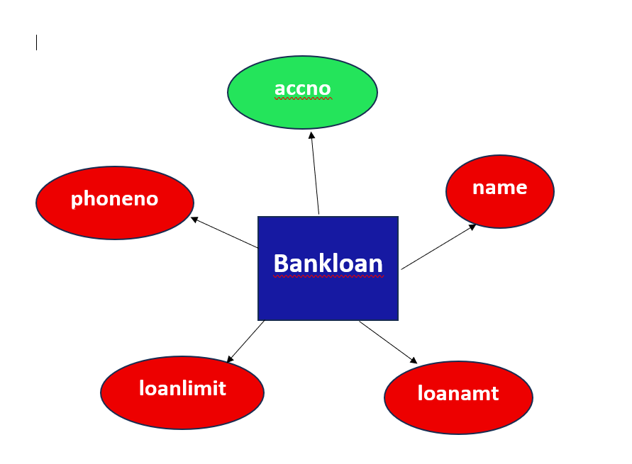
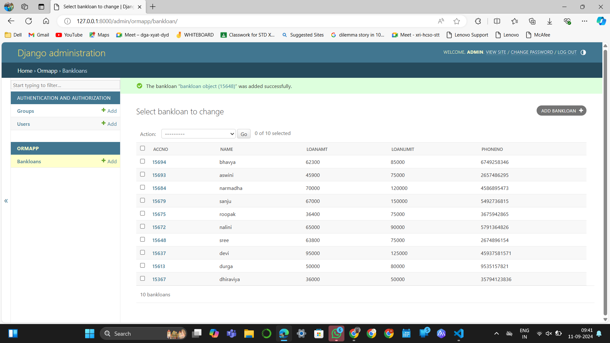

# Ex03 Django ORM Web Application
## Date: 11/09/2024

## AIM
To develop a Django application to store and retrieve data from a bank loan database using Object Relational Mapping(ORM).

## ENTITY RELATIONSHIP DIAGRAM



## DESIGN STEPS

### STEP 1:
Clone the problem from GitHub

### STEP 2:
Create a new app in Django project

### STEP 3:
Enter the code for admin.py and models.py

### STEP 4:
Execute Django admin and create details for 10 books

## PROGRAM

```
from django.db import models

# Create your models here.
from django.contrib import admin
class bankloan(models.Model):
    accno=models.IntegerField(primary_key=True);
    name=models.CharField(max_length=100);
    loanamt=models.IntegerField();
    loanlimit=models.IntegerField();
    phoneno=models.IntegerField();

class bankloanAdmin(admin.ModelAdmin):
    list_display=('accno','name','loanamt','loanlimit','phoneno')
```

## OUTPUT

Include the screenshot of your admin page.


## RESULT
Thus the program for creating a database using ORM hass been executed successfully
